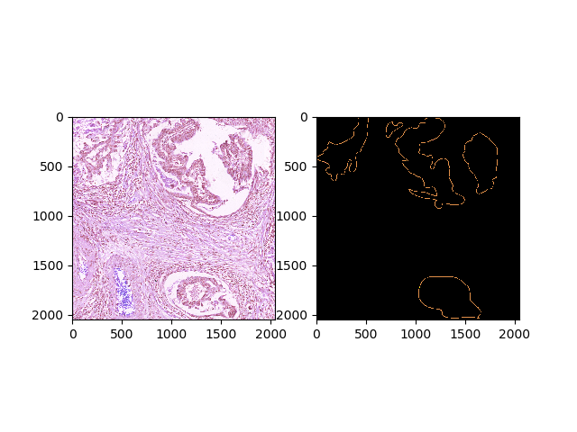
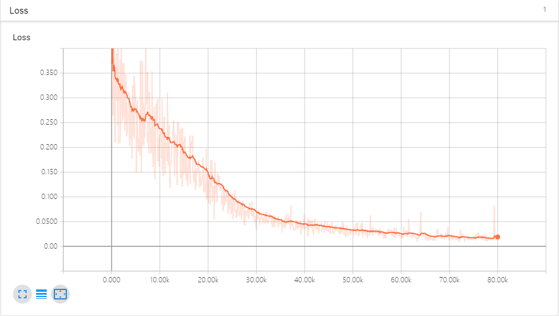
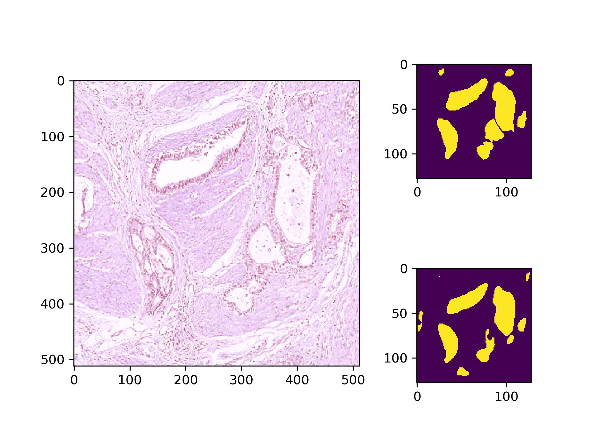
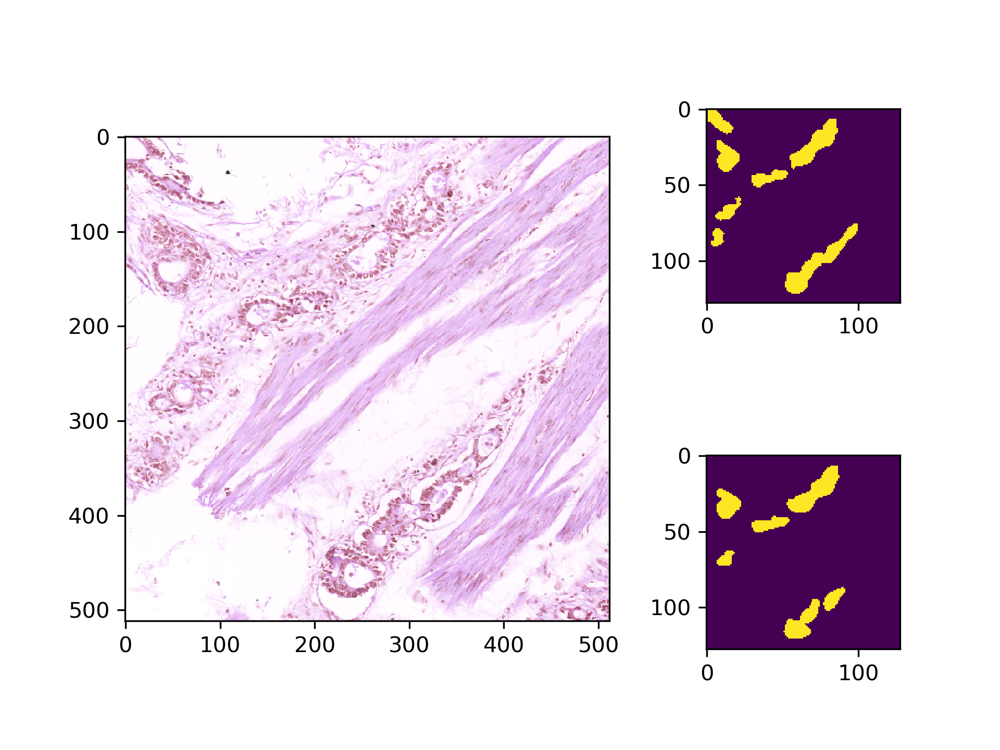
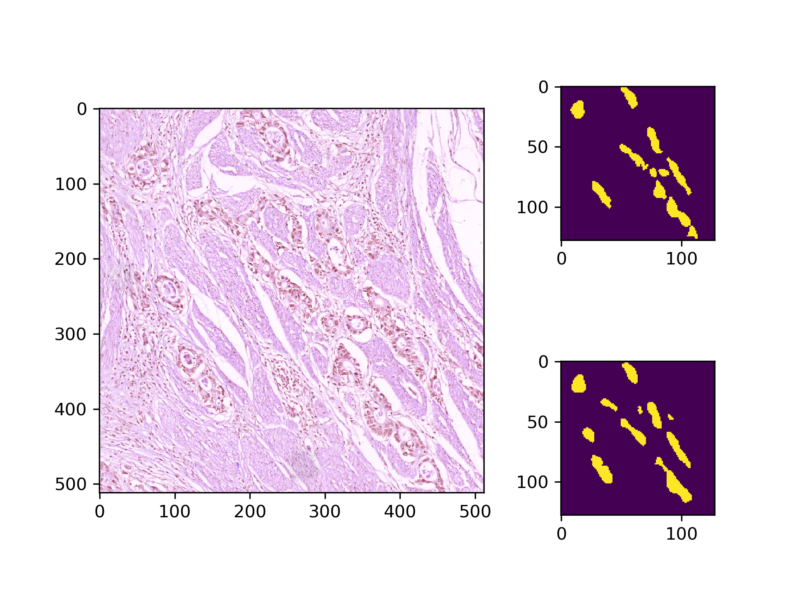
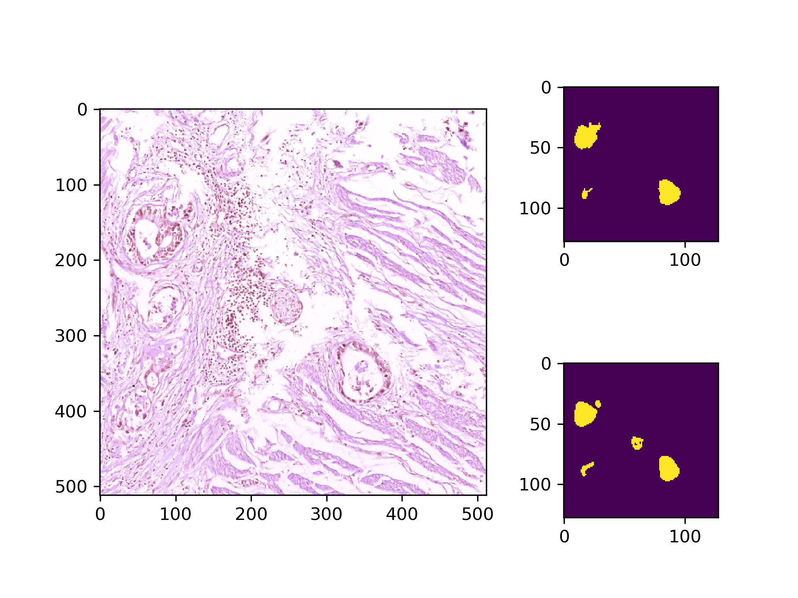

# 胃癌切片分隔

## 问题描述

使用机器学习的方法构建一个识别，检测，分隔癌细胞切片的模型。

### 数据集

## 预处理

### 填充ROI

使用floodfill对标签图片的四角进行填充，在没有环以及癌变区域边界封闭的情况下可以实现对ROI的填充。若标签不理想会出现一定的误差。

### 划分训练集和测试集

由于数据集过小，取出有癌细胞的样例80个和无癌细胞的样例20个组成测试集，其余划分为训练集。

训练集1300张，测试集100张。

### 数据增强

对图像进行旋转、镜像翻转，使数据集扩增到八倍。

### 图像裁剪

切片图像裁剪为512x512，标签裁剪为128x128。

### 储存数据集

将数据集储存为TF Record格式，方便使用。

## 构建网络及训练

### FCN

### 训练

使用Adam Optimizer迭代100个Epoch。

## 成果展示

对于癌变切片有较好表现，能基本正确识别癌变的区域，但是对于没有癌变的切片，也会错误地识别一些区域。

## 总结

该程序只能用作癌细胞的预检测，还需要人工进行修正。